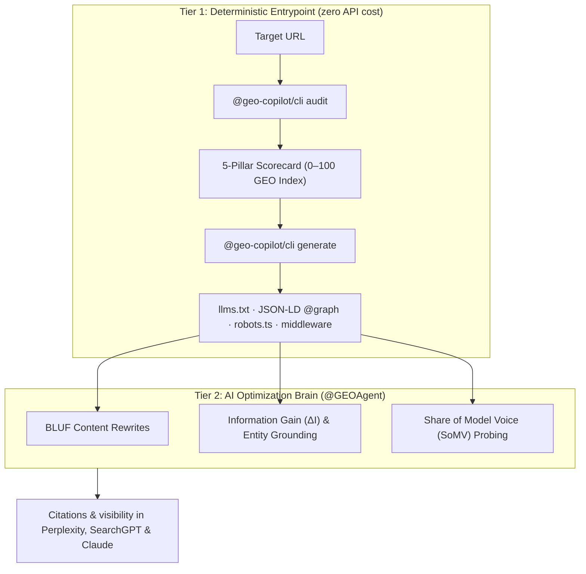

# GEO-Copilot 🧭

> **The open-source Generative Engine Optimization (GEO) & AI search visibility engine.**  
> Built for developers, AI coding assistants, and modern web stacks. Grounded in empirical retrieval research ([ACM SIGKDD / KDD '24](https://arxiv.org/abs/2311.09735)).

[](LICENSE)
[](tsconfig.json)
[](turbo.json)
[](docs/research/academic-foundations.md)

Traditional SEO ranks links. Generative Engine Optimization earns **citations in synthesized AI answers** — from Perplexity, OpenAI SearchGPT, Google Gemini AI Overviews, Claude with Search, and Microsoft Copilot. GEO-Copilot gives you the tooling to audit, score, and optimize for that pipeline.

---

## Why GEO?

Modern AI search evaluates sources through a **4-stage RAG pipeline** that conventional SEO entirely ignores:

| Stage | Mechanism |
|---|---|
| **Hybrid Retrieval** | Vector embeddings + lexical BM25 over chunked web data |
| **Neural Reranking** | ColBERT / Cross-Encoders filter to top 256–512 token passages |
| **Context Window Packing** | Top factual propositions extracted into the LLM context |
| **Grounded Synthesis** | LLM synthesizes answers and allocates citations to high-density, structured sources |

Keyword stuffing and legacy SEO metadata actively degrade retrieval scores in this pipeline. **GEO optimizes directly for the mechanics of LLM citation selection.**

---

## Architecture

GEO-Copilot operates across two complementary tiers:



**Tier 1 — Mechanical entrypoint (CLI & MCP server):** High-speed, zero-cost deterministic scaffolding. Crawls with simulated AI bot user-agents, audits SSR vs. hydration deltas, and generates `/llms.txt`, structured JSON-LD, and `robots.ts`.

**Tier 2 — Specialist brain ([`@GEOAgent`](GEOAgent.md)):** The autonomous AI optimization engineer. Analyzes audit findings, re-engineers prose with **BLUF** (Bottom Line Up Front), injects novel empirical statistics (**Information Gain ΔI**), builds ontological entity graphs, and probes Share of Model Voice (SoMV).

---

## Quick Start

### CLI — zero install

Audit any live website and generate production manifests directly from the terminal:

```bash
# 5-pillar terminal audit
npx @geo-copilot/cli audit https://example.com

# Full JSON report — ideal for CI/CD pipelines
npx @geo-copilot/cli audit https://example.com --json --output report.json

# Generate /llms.txt manifest (llmstxt.org standard)
npx @geo-copilot/cli generate https://example.com --type llms_txt > public/llms.txt

# Generate structured JSON-LD @graph schema
npx @geo-copilot/cli generate https://example.com --type jsonld

# Generate Next.js App Router robots.ts (permits AI crawlers)
npx @geo-copilot/cli generate https://example.com --type robots > app/robots.ts

# Generate Next.js markdown content-negotiation middleware
npx @geo-copilot/cli generate https://example.com --type middleware > middleware.ts
```

### AI IDE / Cursor & Claude Desktop — MCP

Equip your AI assistant with **6 native GEO tools** by adding one block to your MCP configuration:

```json
{
  "mcpServers": {
    "geo-copilot": {
      "command": "npx",
      "args": ["-y", "@geo-copilot/mcp-server"]
    }
  }
}
```

Or install via Smithery with one command:
```bash
npx -y @smithery/cli install @geo-copilot/mcp-server --client cursor
```

**Available tools:**

| Tool | Description |
|---|---|
| `geo_audit_url` | Full 5-pillar GEO audit on any live URL |
| `geo_list_findings` | Prioritized findings filtered by pillar and severity |
| `geo_generate_artifact` | Generate `llms_txt`, `jsonld_graph`, `robots_ts`, and more |
| `geo_create_mutation_plan` | Safety-classified file mutation plans (Class A / B / C) |
| `geo_apply_mutation` | Exact source code patches ready for injection |
| `geo_somv_score` | 4-intent synthetic benchmarks to probe LLM brand visibility |

### TypeScript SDK

Import packages directly into custom crawler jobs, CI pipelines, or internal tooling:

```typescript
import { crawlUrl } from '@geo-copilot/crawler'
import { GEOScoringEngine } from '@geo-copilot/scorer'
import { generateLlmsTxtFromCrawl } from '@geo-copilot/artifact-gen'

// Crawl with simulated AI bot user-agents
const crawl = await crawlUrl('https://example.com', {
  fetchHydrated: true,
  testMarkdownNegotiation: true,
})

// Compute 0–100 deterministic score across 5 pillars
const scorer = new GEOScoringEngine()
const result = scorer.score({ crawlResult: crawl })
console.log(`GEO Score: ${result.total}/100 (${result.grade})`)

// Generate production /llms.txt
const llmsTxt = generateLlmsTxtFromCrawl(crawl)
```

---

## Terminal Scorecard

Running `npx @geo-copilot/cli audit https://example.com` produces an instant terminal scorecard:

```
╔═══════════════════════════════════════════════════════════════════════╗
║  🌐 GEO-Copilot Audit Report                                         ║
║  Target URL: https://example.com                                      ║
╠═══════════════════════════════════════════════════════════════════════╣
║                                                                       ║
║   TOTAL GEO SCORE:   78/100  ██████████████████░░░░░░   B             ║
║                                                                       ║
╠═══════════════════════════════════════════════════════════════════════╣
║  5-PILLAR BREAKDOWN (Academic GEO Rubric)                             ║
╠═══════════════════════════════════════════════════════════════════════╣
║   1. Crawler Layer (SSR & AI Bots)   18/20  ██████████████░░  A       ║
║   2. Knowledge Graph (JSON-LD)       12/20  █████████░░░░░░░  C       ║
║   3. Information Gain (ΔI Density)   14/20  ███████████░░░░░  C       ║
║   4. BLUF Answer Architecture        19/20  ███████████████░  A       ║
║   5. Share of Model Voice (SoMV)     15/20  ████████████░░░░  B       ║
╚═══════════════════════════════════════════════════════════════════════╝

Top Actionable Findings:
[HIGH] [knowledge_graph] Missing connected JSON-LD @graph
  Site lacks linked Organization, WebSite, or SoftwareApplication schemas.
  Fix: Embed structured JSON-LD @graph schema in root layout.
```

---

## The 5 Scoring Pillars

| Pillar | Max | Why LLMs care | What is evaluated |
|---|---|---|---|
| **Crawler Layer** | 20 | AI crawlers bypass heavy client-side JS to conserve compute | `robots.txt` AI UAs (`GPTBot`, `ClaudeBot`, `PerplexityBot`), `/llms.txt` presence, SSR vs. hydration delta, markdown negotiation headers |
| **Knowledge Graph** | 20 | Retrieval systems disambiguate entities by linking to recognized knowledge bases | Linked JSON-LD `@graph` (`Organization`, `WebSite`, `SoftwareApplication`), Wikidata `sameAs`, semantic HTML landmarks |
| **Information Gain (ΔI)** | 20 | LLM synthesizers prefer citing novel statistics and original data over redundant summaries | Factual metric density, numerical proof points, benchmark tables, author quotations |
| **BLUF Architecture** | 20 | Neural rerankers clip retrieval chunks to 256–512 tokens — buried answers get severed from their context | 40–60 word opening thesis statements, atomic self-contained blocks, table representations |
| **Share of Model Voice** | 20 | Quantifies whether LLMs actually recommend, cite, or mention your brand | 4-intent synthetic prompts (Exploration, Comparison, Feature, Troubleshooting) tested against live LLMs |

---

## @GEOAgent — Public Agent Profile

The full system instructions, scoring rubric, and guardrails for **`@GEOAgent`** are published openly:

📄 **[`GEOAgent.md`](GEOAgent.md)**

Example prompts to pair with `@GEOAgent`:

- *"Adopt the role of @GEOAgent. Audit our landing page at https://example.com and create a Class B mutation plan to improve AI search visibility."*
- *"Inspect `app/docs/page.tsx` and rewrite the opening section using BLUF principles (40–60 word standalone thesis)."*
- *"Build a connected JSON-LD `@graph` schema linking our `Organization` to our Wikidata entity, founders, and primary software capabilities."*
- *"Evaluate our latest release notes for Information Gain (ΔI) and restructure our benchmarks into markdown tables."*

> [!NOTE]
> **Adapting to your harness or provider schema:** `GEOAgent.md` is a canonical reference specification. Adapt the YAML frontmatter, tool definitions, and system prompts to match your schema — whether you use Cursor Rules, Claude Desktop, Windsurf, OpenCode, Antigravity, or custom frameworks (LangGraph, CrewAI, AutoGen).

---

## Academic Foundations

GEO-Copilot is built on empirical information retrieval and NLP research:

- 📄 **"GEO: Generative Engine Optimization"** — Aggarwal et al. (Princeton, Georgia Tech, Allen Institute for AI, IIT Delhi) — *ACM SIGKDD KDD '24*, [arXiv:2311.09735](https://arxiv.org/abs/2311.09735)
- 📄 **"ColBERT: Efficient and Effective Passage Search via Contextualized Late Interaction over BERT"** — Khattab & Zaharia (Stanford) — *ACM SIGIR*, [arXiv:2004.12832](https://arxiv.org/abs/2004.12832)
- 📄 **"Lost in the Middle: How Language Models Use Long Contexts"** — Liu et al. (Stanford, UC Berkeley) — *TACL '24*, [arXiv:2307.03172](https://arxiv.org/abs/2307.03172)

👉 **[Full scientific review: Academic Foundations & Research Behind GEO](docs/research/academic-foundations.md)**

```bibtex
@inproceedings{aggarwal2024geo,
  title={GEO: Generative Engine Optimization},
  author={Aggarwal, Pranjal and Murahari, Vishvak and Rajpurohit, Tanmay and Kalyan, Ashwin and Narasimhan, Karthik and Deshpande, Ameet},
  booktitle={Proceedings of the 30th ACM SIGKDD Conference on Knowledge Discovery and Data Mining (KDD '24)},
  year={2024}
}
```

---

## Packages

| Package | Description |
|---|---|
| [`@geo-copilot/cli`](packages/cli) | Zero-dependency terminal runner for audits and manifest generation |
| [`@geo-copilot/mcp-server`](apps/mcp-server) | Stdio MCP server exposing 6 GEO tools to AI coding assistants |
| [`@geo-copilot/core`](packages/core) | TypeScript types, Zod schemas, scoring models & interfaces |
| [`@geo-copilot/crawler`](packages/crawler) | High-speed AI bot UA crawler & SSR hydration delta parser |
| [`@geo-copilot/scorer`](packages/scorer) | 5-pillar deterministic scoring engine (0–100 GEO Index) |
| [`@geo-copilot/artifact-gen`](packages/artifact-gen) | Deterministic `llms.txt`, JSON-LD schema, and robots generator |
| [`@geo-copilot/somv-engine`](packages/somv-engine) | Share of Model Voice (SoMV) multi-intent probing engine |

---

## Local Development

```bash
git clone https://github.com/nachorotth/geo-copilot.git
cd geo-copilot

pnpm install   # install dependencies
pnpm build     # build all packages
pnpm test      # run unit tests
pnpm typecheck # fast monorepo typecheck
```

---

## License

MIT License © 2026 GEO-Copilot Contributors.
